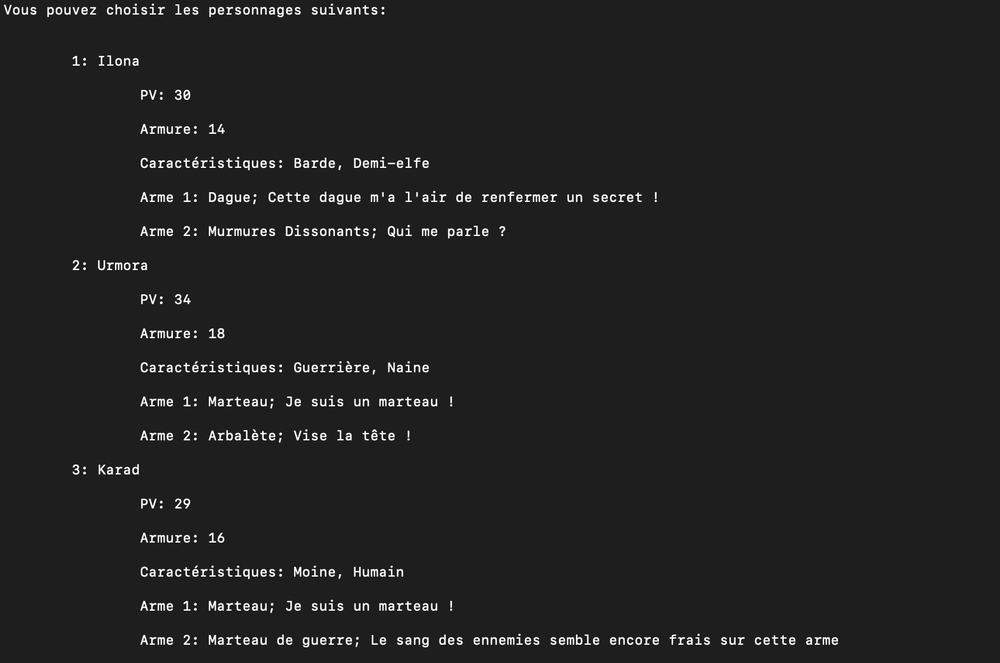
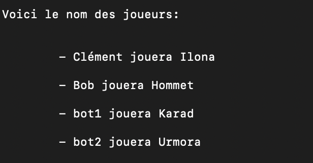
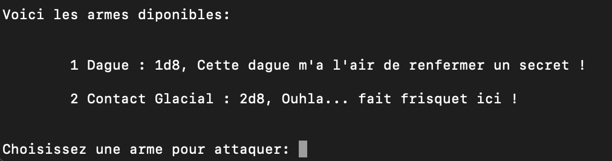
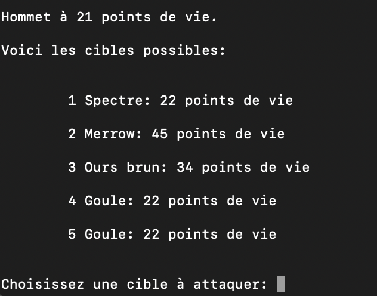

# Écrire du code maintenable en python

## Objectifs :

Ce projet n'a pas pour objectif de démontrer des compétences techniques poussées, mais de m'entrainer à l'écriture d'un code python maintenable et suivant ces quelques recommandations : 
 - suivre les [PEP 8](https://peps.python.org/pep-0008/) et [PEP 256](https://peps.python.org/pep-0256/)
 - utiliser les design paterns Constant et Decorateur
 - utiliser le patern d'architecture MVC (Model - View - Controller)
 - utiliser les principes SOLID

Ces objectifs sont décrits dans ce [cours](https://openclassrooms.com/fr/courses/7160741-ecrivez-du-code-python-maintenable).

## Description du projet

Ce projet est un jeu de rôle fortement inspiré de Donjons et Dragons (dans une forme fortement simplifiée). Vous pourrez incarner un ou plusieurs personnages, jouer avec des bots à vos côtés face à une horde de monstres.

Vous pouvez jouer de nombreux personnages : 

Combattez à côté de vos amis ou de bots:

Choisissez vos armes : 

Massacrez les monstres !

